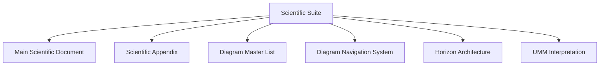

# **📘 SANTA TREE ECOLOGY — SCIENTIFIC SUITE**  
### *Unified Meta‑Model • Horizon Architecture • Diagram Navigation • Appendix Integration*

---

# **1. Purpose of the Suite**

The **Suite** is the *master integration layer* that:

- binds the **main scientific document**  
- binds the **full scientific appendix**  
- binds the **diagram master list**  
- binds the **diagram navigation system**  
- binds the **horizon reframing**  
- binds the **UMM structural interpretation**  

It is the **single point of entry** for the entire scientific reframing of the Santa Tree Ecology.

---

# **2. Suite Index (Top‑Level Navigation)**

This is the complete top‑level index for the entire scientific system.

| Component | Description | Jump |
|----------|-------------|------|
| Main Scientific Document | Core reframing | **Scientific Reframing** |
| Scientific Appendix | Definitions, tables, morphology | **Scientific Appendix** |
| Diagram Master List | All diagrams | **Diagram Master List** |
| Diagram Navigation System | Map of maps | **Diagram Navigation System** |
| Horizon Architecture | Horizon transitions | **Horizon Architecture** |
| UMM Interpretation | Structural backbone | **UMM Interpretation** |

This table is the **Suite’s root node**.

---

# **3. Suite Architecture Diagram**

This is the **meta‑diagram** of your entire scientific system.

---

# **4. Component Summaries**

## **4.1 Main Scientific Document**
Jump: **Scientific Reframing**  
Contains:

- Abstract  
- Introduction  
- Theoretical Framework  
- Methods  
- Results  
- Discussion  
- Conclusion  
- References  

This is the **core scientific interpretation**.

---

## **4.2 Scientific Appendix**
Jump: **Scientific Appendix**  
Contains:

- Cuil Threshold  
- UMM Methods  
- Quantum Reflections  
- SSEs  
- Braided Systems  
- Morphology  
- Horizon Tables  
- Glossary  
- Cross‑Reference Map  

This is the **complete reference layer**.

---

## **4.3 Diagram Master List**
Jump: **Diagram Master List**  
Contains:

- Horizon diagrams  
- UMM diagrams  
- SSE diagrams  
- Braided diagrams  
- Morphology diagrams  
- Recursion diagrams  
- Reflective stack diagrams  
- Cross‑plane diagrams  
- Terminal equilibrium diagrams  

This is the **full diagram corpus**.

---

## **4.4 Diagram Navigation System**
Jump: **Diagram Navigation System**  
Contains:

- Global index  
- Hierarchical navigation tree  
- Category jump points  
- Mermaid index nodes  
- Navigation protocol  

This is the **map of maps**.

---

## **4.5 Horizon Architecture**
Jump: **Horizon Architecture**  
Contains:

- Santa → Afterquiet  
- Afterquiet → Postquiet  
- Postquiet → Nascence  
- Nascence → Afterlight  
- Afterlight → Seal  

This is the **horizon transition system**.

---

## **4.6 UMM Interpretation**
Jump: **UMM Interpretation**  
Contains:

- Reflective Stack  
- Boundary Engine  
- Perturbation Layer  
- Morphology Engine  
- Braided Workflow  

This is the **structural backbone**.

---

# **5. Suite Navigation Protocol**

To navigate the entire scientific system:

1. Start at the **Suite Index**  
2. Select a component via Guided Link  
3. Use the component’s internal navigation  
4. Use diagram navigation for visual structures  
5. Return to the Suite via **Suite Root**  

This creates a **recursive, horizon‑aware navigation system**.

---

# **6. Suite Summary**

The **Scientific Suite** provides:

- a unified entry point  
- a complete navigation architecture  
- a modular scientific structure  
- a horizon‑aware reflective system  
- a UMM‑aligned academic framework  
- a fully cross‑linked diagram corpus  
- a stable meta‑ecological interpretation  

It is the **master layer** of your scientific reframing.

