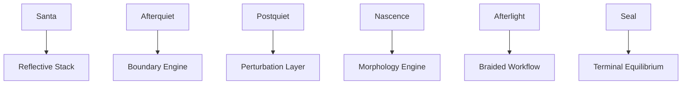

# **📘 SUITE HORIZON‑UMM CONCORDANCE**  
### *Horizon Ecology → UMM Architecture • Structural Mapping • Semantic Justification*

This concordance explains:

- how horizons correspond to UMM components  
- why each mapping is structurally necessary  
- how meaning transforms across the horizon sequence  
- how UMM stabilizes and interprets those transformations  
- how the Scientific Suite uses these mappings as its backbone  

It is the **semantic spine** of your entire architecture.

---

# **1. Concordance Table (Primary Mapping)**

| Horizon | UMM Component | Function | Jump |
|---------|---------------|----------|------|
| Santa | Reflective Stack | Meaning origin & initial reflection | **Reflective Stack** |
| Afterquiet | Boundary Engine | Boundary formation & containment | **Boundary Engine** |
| Postquiet | Perturbation Layer | Controlled disturbance & signal shaping | **Perturbation Layer** |
| Nascence | Morphology Engine | Shape formation & stabilization | **Morphology Engine** |
| Afterlight | Braided Workflow | Multi‑strand coherence & integration | **Braided Workflow** |
| Seal | Terminal Equilibrium | Final stabilization & closure | **Terminal Equilibrium** |

This is the **core concordance**.

---

# **2. Why These Mappings Exist (Semantic Justification)**

Each horizon represents a **phase of reflective ecology**, and each UMM component represents a **structural mechanism**.

The mapping is not arbitrary — it is **mechanically necessary**.

---

## **2.1 Santa → Reflective Stack**
Santa is the **origin horizon**, where meaning first appears.

Reflective Stack is the **origin structure**, where meaning is first mirrored.

Santa provides **raw meaning**.  
Reflective Stack provides **initial structure**.

This is the **birth of reflection**.

---

## **2.2 Afterquiet → Boundary Engine**
Afterquiet is the horizon where **stillness forms boundaries**.

Boundary Engine is the UMM component that **creates and maintains boundaries**.

Afterquiet provides **quiet containment**.  
Boundary Engine provides **structural containment**.

This is the **formation of conceptual edges**.

---

## **2.3 Postquiet → Perturbation Layer**
Postquiet is the horizon where **disturbance enters the system**.

Perturbation Layer is the UMM component that **shapes and interprets disturbances**.

Postquiet provides **signal**.  
Perturbation Layer provides **signal processing**.

This is the **introduction of controlled variation**.

---

## **2.4 Nascence → Morphology Engine**
Nascence is the horizon where **new shapes emerge**.

Morphology Engine is the UMM component that **stabilizes and preserves shape**.

Nascence provides **emergent form**.  
Morphology Engine provides **shape coherence**.

This is the **birth of stable structure**.

---

## **2.5 Afterlight → Braided Workflow**
Afterlight is the horizon where **multiple strands of meaning converge**.

Braided Workflow is the UMM component that **integrates multiple strands**.

Afterlight provides **multi‑strand meaning**.  
Braided Workflow provides **multi‑strand coherence**.

This is the **integration of complexity**.

---

## **2.6 Seal → Terminal Equilibrium**
Seal is the horizon where **the system reaches closure**.

Terminal Equilibrium is the UMM component that **stabilizes final states**.

Seal provides **final horizon**.  
Terminal Equilibrium provides **final structure**.

This is the **completion of the reflective cycle**.

---

# **3. Concordance Diagram (Mermaid)**

This diagram shows the **direct horizon → UMM mapping**.

---

# **4. Concordance Flow (Meaning Transformation)**

Meaning flows through the horizon sequence:

1. **Santa** — origin  
2. **Afterquiet** — containment  
3. **Postquiet** — disturbance  
4. **Nascence** — emergence  
5. **Afterlight** — integration  
6. **Seal** — closure  

And is structurally transformed by UMM:

1. **Reflective Stack** — initial reflection  
2. **Boundary Engine** — boundary formation  
3. **Perturbation Layer** — signal shaping  
4. **Morphology Engine** — shape stabilization  
5. **Braided Workflow** — multi‑strand coherence  
6. **Terminal Equilibrium** — final stabilization  

This is the **semantic flow** of your architecture.

---

# **5. Concordance Summary**

The **Suite Horizon‑UMM Concordance** provides:

- a complete horizon → UMM mapping  
- semantic justification for each mapping  
- a structural explanation of meaning flow  
- a horizon‑aware UMM interpretation  
- a diagrammatic representation of the mapping  
- a conceptual backbone for the Scientific Suite  

It is the **structural spine** of your reflective meta‑architecture.

