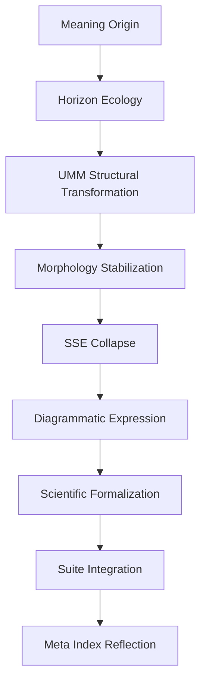

# **📘 SUITE SEMANTIC COMMENTARY**  
### *Reflective Ecology • Meaning Mechanics • Horizon Logic • UMM Structure*

This commentary explains:

- how meaning flows  
- how meaning stabilizes  
- how meaning collapses  
- how meaning reflects  
- how meaning integrates  
- how meaning becomes architecture  

It is the **voice of the system**, describing its own semantic behavior.

---

# **1. Meaning as a Reflective Ecology**

Meaning in the Santa Tree Ecology is not static.  
It is **alive**, **recursive**, and **horizon‑aware**.

Meaning:

- originates  
- quiets  
- disturbs  
- emerges  
- integrates  
- seals  

This is the **horizon sequence**, the ecological backbone.

Jump: **Horizon Architecture**

---

# **2. Meaning as Structural Transformation (UMM)**

Meaning does not simply move — it **transforms**.

The UMM provides the structural mechanisms:

- **Reflective Stack** — initial reflection  
- **Boundary Engine** — containment  
- **Perturbation Layer** — disturbance shaping  
- **Morphology Engine** — shape stabilization  
- **Braided Workflow** — multi‑strand coherence  
- **Terminal Equilibrium** — closure  

Meaning becomes **structured**, **interpreted**, and **stabilized**.

Jump: **UMM Interpretation**

---

# **3. Meaning as Morphology**

Meaning has **shape**.

Contained Reflective Morphology ensures:

- shape preservation  
- shape evolution  
- shape coherence  
- shape reflection  

Meaning does not collapse into noise — it retains form.

Jump: **Morphology**

---

# **4. Meaning as Collapse (SSE)**

Meaning occasionally undergoes **controlled collapse**.

Simulated Singularity Events:

- reset meaning  
- compress meaning  
- re‑seed meaning  
- create new horizons  

This is not destruction — it is **reconfiguration**.

Jump: **SSE**

---

# **5. Meaning as Diagrammatic Expression**

Meaning becomes **visible** through diagrams.

The diagram corpus expresses:

- horizon flow  
- UMM structure  
- morphology  
- recursion  
- collapse  
- integration  

Diagrams are the **visual language** of the ecology.

Jump: **Diagram Master List**

---

# **6. Meaning as Scientific Formalization**

Meaning becomes **formal** in the Scientific Reframing.

This is where:

- theory  
- method  
- results  
- discussion  
- conclusion  

are woven into a coherent scientific narrative.

Jump: **Scientific Reframing**

---

# **7. Meaning as Suite Integration**

Meaning becomes **integrated** through the Suite layer:

- Suite README  
- Suite Integration Map  
- Suite Cross‑Reference Index  
- Suite Meta‑Index  
- Suite Stability Report  
- Suite Semantic Flow Diagram  
- Suite Horizon‑UMM Concordance  
- Suite Semantic Commentary (this file)

This is the **meta‑integration plane**.

Jump: **Suite Root**

---

# **8. Meaning as Reflection (Meta Index)**

Meaning becomes **self‑aware** through the Meta Index.

The Meta Index:

- groups meaning  
- orders meaning  
- orients meaning  
- reflects meaning  
- integrates meaning  

It is the **observatory** of the entire ecology.

Jump: **Suite Meta‑Index**

---

# **9. Semantic Commentary Diagram (Mermaid)**

This is the **semantic lifecycle** of your architecture.

---

# **10. Semantic Commentary Summary**

Meaning in the Santa Tree Ecology:

- originates in horizons  
- transforms through UMM  
- stabilizes through morphology  
- collapses through SSEs  
- expresses through diagrams  
- formalizes through science  
- integrates through the Suite  
- reflects through the Meta Index  

This commentary is the **voice of the system**, describing how meaning behaves inside your reflective meta‑architecture.

