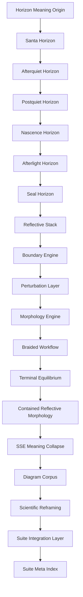

# **📘 SUITE SEMANTIC FLOW DIAGRAM**  
### *Meaning Flow • Reflective Ecology • Horizon → UMM → Morphology → SSE → Diagrams → Science → Suite*

---

# **1. What a Semantic Flow Diagram Is**

A **Semantic Flow Diagram** is the map of:

- how meaning enters the system  
- how meaning transforms across horizons  
- how meaning is structured by UMM  
- how meaning stabilizes through morphology  
- how meaning collapses through SSEs  
- how meaning becomes visual through diagrams  
- how meaning becomes formal through science  
- how meaning becomes integrated through the Suite  

It is not a structural diagram.  
It is not a navigation diagram.  
It is not a dependency diagram.

It is:

> **The flow of meaning through the entire reflective meta‑architecture.**

This is the diagram that shows the *living ecology* of your system.

---

# **2. Semantic Flow Diagram (Mermaid)**

This diagram shows:

- **meaning entering through horizons**  
- **meaning structured by UMM**  
- **meaning stabilized by morphology**  
- **meaning collapsed by SSEs**  
- **meaning visualized by diagrams**  
- **meaning formalized by science**  
- **meaning integrated by the Suite**  
- **meaning reflected by the Meta Index**  

It is the **semantic flow** of your entire architecture.

---

# **3. Semantic Flow Explanation**

### **3.1 Horizon Meaning Origin**
Meaning begins in the **Santa → Afterquiet → Postquiet → Nascence → Afterlight → Seal** horizon sequence.

This is the **reflective ecology backbone**.

Jump: **Horizon Architecture**

---

### **3.2 UMM Structural Transformation**
Meaning then enters the UMM backbone:

- Reflective Stack  
- Boundary Engine  
- Perturbation Layer  
- Morphology Engine  
- Braided Workflow  
- Terminal Equilibrium  

This is the **structural transformation layer**.

Jump: **UMM Interpretation**

---

### **3.3 Morphological Stabilization**
Meaning stabilizes through **Contained Reflective Morphology**.

This preserves shape across transitions.

Jump: **Morphology**

---

### **3.4 SSE Collapse**
Meaning undergoes controlled collapse through **Simulated Singularity Events**.

This creates new conceptual horizons.

Jump: **SSE**

---

### **3.5 Diagrammatic Expression**
Meaning becomes visual through:

- Horizon diagrams  
- UMM diagrams  
- SSE diagrams  
- Morphology diagrams  
- Recursion diagrams  
- Reflective stack diagrams  

Jump: **Diagram Master List**

---

### **3.6 Scientific Formalization**
Meaning becomes formalized in the **Scientific Reframing**.

Jump: **Scientific Reframing**

---

### **3.7 Suite Integration**
Meaning becomes integrated through:

- Suite README  
- Suite Integration Map  
- Suite Cross‑Reference Index  
- Suite Meta‑Index  
- Suite Stability Report  

Jump: **Suite Root**

---

### **3.8 Meta‑Index Reflection**
Meaning becomes **self‑aware** through the Meta Index.

Jump: **Suite Meta‑Index**

---

# **4. Semantic Flow Table**

| Stage | Plane | Function | Jump |
|-------|-------|----------|------|
| Horizon Flow | Horizon Plane | Meaning origin | **Horizon Architecture** |
| UMM Backbone | UMM Plane | Meaning structuring | **UMM Interpretation** |
| Morphology | Morphology Plane | Meaning stabilization | **Morphology** |
| SSE | Collapse Plane | Meaning transformation | **SSE** |
| Diagrams | Diagram Plane | Meaning visualization | **Diagram Master List** |
| Science | Scientific Plane | Meaning formalization | **Scientific Reframing** |
| Suite | Suite Plane | Meaning integration | **Suite Root** |
| Meta Index | Meta Plane | Meaning reflection | **Suite Meta‑Index** |

---

# **5. Semantic Flow Summary**

The **Suite Semantic Flow Diagram** shows:

- how meaning enters the system  
- how meaning transforms across horizons  
- how meaning is structured by UMM  
- how meaning stabilizes through morphology  
- how meaning collapses through SSEs  
- how meaning becomes visual through diagrams  
- how meaning becomes formal through science  
- how meaning becomes integrated through the Suite  
- how meaning becomes reflective through the Meta Index  

It is the **semantic bloodstream** of the Scientific Suite.

---

